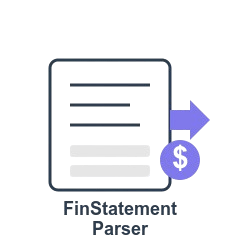

# Financial Statement Parser

<div align="center">
  
  <br>
  <strong>Extract structured data from financial statement PDFs</strong>
  <br>
  <i>Developed and maintained by <a href="https://azdv.co">AZdev</a> - FinTech Innovation Execution Leaders</i>
</div>

<br>

[](LICENSE)
[](#status)
[](https://www.python.org/downloads/)

## The Problem

Financial developers and engineers waste countless hours manually extracting data from bank statements, credit card statements, and other financial PDFs. Each institution uses different formats, making automated processing a persistent challenge.

This library provides a standardized way to extract structured data from financial statement PDFs with minimal setup, saving developers significant time and effort.

## Key Features

- **Universal PDF Extraction**: Works with statements from major financial institutions
- **Automatic Institution Detection**: Identifies the source institution
- **Comprehensive Data Extraction**:
  - Account information (number, type)
  - Statement period (start/end dates)
  - Balance information (opening/closing)
  - Complete transaction lists
- **Transaction Categorization**: Automatically classifies transactions into categories
- **Confidence Scoring**: Reliability ratings for each extracted data point
- **Parallel Processing**: Efficient batch processing for multiple statements
- **Debug Mode**: Detailed logging for troubleshooting
- **Clean, Consistent Output**: Standardized JSON regardless of source format

## Quick Start

### Installation

```bash
git clone https://github.com/AZdv/finstatement-parser.git
cd finstatement-parser
pip install -e .
```

This package is **not published to PyPI**. Install from source.

### Basic Usage

```python
import finstatement

# Parse a statement PDF
result = finstatement.parse("statement.pdf")

# Access structured data
print(f"Account: {result.account_info.number}")
print(f"Period: {result.period.start} to {result.period.end}")
print(f"Closing Balance: ${result.balance.closing:.2f}")

# Get transactions
for tx in result.transactions:
    print(f"{tx.date.strftime('%m/%d/%Y')} | ${tx.amount:.2f} | {tx.description}")

# Export as standardized JSON
json_data = result.to_json()
```

### Example Script

The package includes a simple example script for quick demonstration:

```bash
python example.py path/to/your/statement.pdf
```

### Advanced Usage

#### Batch Processing

Process multiple statements efficiently:

```python
import finstatement
import glob

# Get all PDFs in a directory
pdf_files = glob.glob("statements/*.pdf")

# Process in parallel (default)
results = finstatement.batch_parse(pdf_files)

# Process sequentially
results = finstatement.batch_parse(pdf_files, parallel=False)

# Control parallelism
results = finstatement.batch_parse(pdf_files, max_workers=4)

# Process results
for path, result in results.items():
    print(f"Statement: {path}")
    print(f"Found {len(result.transactions)} transactions")
```

#### Debug Mode

Enable detailed logging for troubleshooting:

```python
import finstatement

# Enable debug mode
result = finstatement.parse("statement.pdf", debug=True)
```

#### Transaction Analysis

Analyze transactions by category:

```python
import finstatement
from collections import defaultdict

result = finstatement.parse("statement.pdf")

# Group transactions by category
by_category = defaultdict(list)
for tx in result.transactions:
    by_category[tx.category or "uncategorized"].append(tx)

# Calculate spending by category
category_totals = {}
for category, transactions in by_category.items():
    category_totals[category] = sum(tx.amount for tx in transactions)
    
# Print summary
for category, total in sorted(category_totals.items(), key=lambda x: x[1]):
    print(f"{category}: ${abs(total):.2f}")
```

## Supported Institutions

The library currently supports basic extraction for statements from:

- Chase Bank
- Bank of America
- Wells Fargo
- Citibank
- American Express
- Discover

Coverage varies by institution and statement layout. Treat the list above as "has been exercised against real statements", not as a compatibility guarantee.

## Data Model

The library provides a clean, structured data model:

```
StatementResult
├── account_info: AccountInfo
│   ├── number: str
│   ├── name: str (optional)
│   ├── institution: str
│   └── type: str (bank, credit_card, investment)
├── period: Period
│   ├── start: datetime
│   └── end: datetime
├── balance: Balance
│   ├── opening: float (optional)
│   └── closing: float
├── transactions: List[Transaction]
│   ├── date: datetime
│   ├── description: str
│   ├── amount: float
│   ├── balance: float (optional)
│   └── category: str (optional)
└── confidence: Dict[str, float]
```

## Use Cases

- **Personal Finance Apps**: Import data from user's financial statements
- **Expense Management Systems**: Automatically process credit card statements
- **Bookkeeping Software**: Extract transaction data for reconciliation
- **Financial Analysis Tools**: Import historical statement data
- **Loan Processing Systems**: Analyze bank statements for affordability checks

## What it does when it cannot read something

This matters more than the happy path, so it is documented before the features.

The parser does not guess. If a field cannot be read it comes back as `None`,
the reason is appended to `result.parse_errors`, and the confidence score for
that field is `0.0`. If the file cannot be read at all it raises
`StatementParseError` rather than returning an empty result.

That is a deliberate reversal. An earlier version of this code did the opposite
and it was wrong in a way worth describing, because the same pattern shows up in
a lot of extraction code:

| When it could not read | It used to return | It now returns |
|---|---|---|
| the PDF at all | the string `"ERROR: Unable to extract text from PDF"`, parsed as if it were statement text | raises `StatementParseError` |
| the statement period | the current calendar month | `None`, recorded in `parse_errors` |
| the closing balance | `0.0` | `None`, recorded in `parse_errors` |
| a transaction date | today's date | the row is dropped and recorded |
| a `MM/DD` date with no year | the year the code was run | the year from the statement period, or the row is dropped |
| the account number | the sentinel string `"Unknown"`, with nothing in `parse_errors` | `None`, recorded in `parse_errors` |
| a partial account number | padded into `xxxx-xxxx-xxxx-1234`, inventing a 16-digit card shape even for a checking account | the digits actually captured, with `number_is_partial` set |

The old confidence scores made it worse rather than catching it. A fabricated
`0.00` balance scored `0.8`, and thirty transactions all stamped with today
scored `0.9`, because the score counted rows instead of measuring what was
known. Wrong figures carrying a high confidence score are worse than an error.

```python
result = finstatement.parse("statement.pdf")

if result.parse_errors:
    for problem in result.parse_errors:
        print(problem)

if result.balance.closing is None:
    ...  # not zero. unknown.
```

Untrusted PDFs are bounded: 50 MB and 500 pages by default, and an encrypted
file that will not open with an empty password raises rather than returning
whatever fragments came out.

## Status

This is a reference implementation, not a supported product. It is published so
the approach can be read and reused, and it is not on PyPI. Issues and pull
requests are reviewed periodically rather than on a schedule. Corrections that
come with a failing example are the fastest thing to get merged.

## Contributing

Contributions are welcome! Here's how you can help:

1. **Add Institution Support**: Implement patterns for new financial institutions
2. **Improve Extraction Accuracy**: Enhance pattern matching for existing institutions
3. **Add New Statement Types**: Support for investment, mortgage, loan statements, etc.
4. **Bug Reports and Feature Requests**: Open issues on GitHub

Please see [CONTRIBUTING.md](CONTRIBUTING.md) for detailed contribution guidelines.

## Roadmap

- [ ] Machine learning enhancements for improved extraction accuracy
- [ ] Transaction categorization based on description patterns
- [ ] Support for international bank formats
- [ ] REST API for cloud-based processing
- [ ] Visual results dashboard
- [ ] Historical statement analysis
- [ ] Integration with personal finance tools

## Performance

The library is optimized for accuracy rather than speed. For large batches, `batch_parse` supports parallel processing. No benchmark figures are published here because none have been measured under a documented methodology.


## Troubleshooting

### Common Issues

| Issue | Solution |
|-------|----------|
| **Low confidence scores** | Enable debug mode to see what patterns were matched. You might need to add institution-specific patterns. |
| **Missing transactions** | Some statements have unusual formatting. Try extracting the text manually to see the structure and submit a feature request. |
| **Incorrect dates** | If your statement uses an unusual date format, you may need to extend the date parsing patterns. |
| **PDF extraction fails** | Try using a different PDF reader like Poppler if PyPDF2 has issues with your document. |
| **Memory issues with large batches** | Reduce the `max_workers` parameter when using `batch_parse`. |

### Debugging Tips

1. Enable debug mode: `finstatement.parse("statement.pdf", debug=True)`
2. Manually extract text: `python -c "import PyPDF2; print(PyPDF2.PdfReader('statement.pdf').pages[0].extract_text()[:500])"`
3. Check if your PDF is compatible: `python -c "import PyPDF2; print(PyPDF2.PdfReader('statement.pdf').metadata)"`
4. For encrypted PDFs, check if they can be opened: `python -c "import PyPDF2; r=PyPDF2.PdfReader('statement.pdf'); print(r.is_encrypted)"`

## Security Note

This library processes financial documents locally. No data is sent to external servers. We recommend implementing additional security measures when handling sensitive financial information in your application.

## License

This project is licensed under the MIT License - see the [LICENSE](LICENSE) file for details.

## About AZdev

[AZdev](https://azdv.co) specializes in mission-critical FinTech engineering and CTO services. We help financial institutions and startups build innovative, scalable, and secure financial technology solutions.

For consulting, custom development, or enterprise support for this library, contact us at info@azdv.co.

---

<div align="center">
  <sub>Built with ❤️ by <a href="https://azdv.co">AZdev</a> - FinTech Innovation Execution Leaders</sub>
</div>
